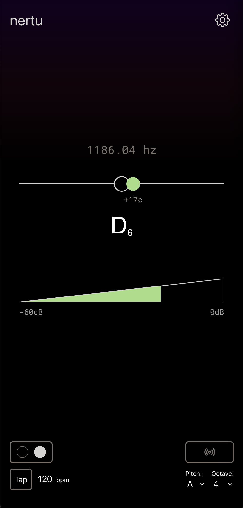

# Nertu

No-nonsense, easy to use tuner web app 🎷

Features:

- ✅ Chromatic tuner with instrument transposition and setting frequency for A4
- ✅ Tuning fork
- ✅ Tap tempo metronome
- ✅ Usable offline as a progressive web app

Visit: [nertu.app](https://nertu.app)

# Desgin

[Figma](https://www.figma.com/file/49Aww3Y3X9R2RRzRZJJIOh/nertu?node-id=0%3A1)
